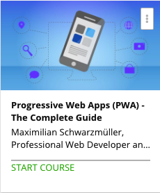

```
Roberto Nogueira  
BSd EE, MSd CE
Solution Integrator Experienced - Certified by Ericsson
```
# Udemy Progressive Web Apps



**About **

Learn everything you need to about the subject of this `Udemy` project.

[Homepage](https://www.udemy.com/progressive-web-app-pwa-the-complete-guide)

## Topics
```
Section: 1
0 / 11
Getting Started
[ ] 1. About this Course 2:06
[ ] 2. What are Progressive Web Apps? 3:24
[ ] 3. PWAs vs Native Mobile Apps 6:07
[ ] 4. A Demo PWA & What We'll Build in this Course 6:24
[ ] 5. Our First Progressive Web App 6:27
[ ] 6. PWA Core Building Blocks 3:19
[ ] 7. Comparing PWAs and SPAs 3:17
[ ] 8. What is "Progressive Enhancement"? 3:23
[ ] 9. Course Outline 4:24
[ ] 10. Course Project Setup 6:10
[ ] 11. How to get the Most out of this Course 2:11

Section: 2
0 / 15
Understanding the App Manifest
[ ] 12. Module Introduction 1:01
[ ] 13. Using an App Manifest to Make your App Installable 1:36
[ ] 14. Adding the Manifest 3:40
[ ] 15. Understanding App Manifest Properties 9:43
[ ] 16. Adding Properties to the App Manifest 9:44
[ ] 17. PWAs and Browser Support 2:16
[ ] 18. Using the Chrome Developer Tools 1:35
[ ] 19. Simulating the Web App on an Emulator 4:37
[ ] 20. Preparing the Emulated Device for ALL PWA Features 0:00
[ ] 21. Installing the Web App - Prerequisites 2:30
[ ] Quiz 1: Understanding manifest.json 0:00
[ ] 22. Adding Properties for Safari 5:50
[ ] 23. Adding Properties for the Internet Explorer 2:30
[ ] 24. Wrap Up 0:28
[ ] 25. Useful Resources & Links 0:00

Section: 3
0 / 16
The Service Workers
[ ] 26. Module Introduction 0:40
[ ] 27. Why Service Workers Are Amazing! 4:40
[ ] 28. Understanding Service Worker Events 6:18
[ ] 29. The Service Worker Lifecycle 5:20
[ ] 30. Service Worker Browser Support 1:24
[ ] 31. Registering a Service Worker 9:26
[ ] 32. Reacting to Incoming Events (in SW) 5:39
[ ] 33. Updating & Activating Service Workers 3:00
[ ] 34. Non-Lifecycle Events 4:50
[ ] 35. Getting that "App Install Banner" 2:40
[ ] 36. Connecting Chrome Developer Tools to a Real/ Emulated Device 0:00
[ ] 37. Testing the App on Real Device (and Installing the App!) 3:42
[ ] 38. Deferring the App Install Banner 6:43
[ ] 39. Wrap Up 1:20
[ ] 40. Service Worker FAQ 0:00
[ ] 41. Useful Resources & Links 0:00

Section: 4
0 / 14
Promise and Fetch
[ ] 42. Module Introduction 0:49
[ ] 43. Async Code in JavaScript 3:54
[ ] 44. Promises - Basics 4:40
[ ] 45. Rejecting Promises 4:05
[ ] 46. Where we Use Promises in our Project 2:25
[ ] 47. Fetch - Basics 6:11
[ ] 48. Sending Post Requests via Fetch 4:22
[ ] 49. Fetch and CORS 3:12
[ ] 50. Comparing Fetch and Ajax 3:04
[ ] 51. Adding Polyfills (for Legacy Browser Support) 3:29
[ ] 52. Fetch & Service Workers 2:05
[ ] Assignment 1: Time to Practice - Promises & Fetch API 0:00
[ ] 53. Wrap Up 0:56
[ ] 54. Useful Resources & Links 0:00

Section: 5
0 / 19
Service Workers - Caching
[ ] 55. Module Introduction 0:43
[ ] 56. Why Caching? 3:06
[ ] 57. Understanding the Cache API 4:00
[ ] 58. Browser Support 1:49
[ ] 59. Adjusting the Course Project 2:53
[ ] 60. Identifying (Pre-)Cacheable Items 3:07
[ ] 61. Static Caching/ Precaching 11:04
[ ] 62. Retrieving Items from the Cache 4:55
[ ] 63. Adding & Retrieving Multiple Files (to/ from Cache) 3:06
[ ] 64. Cache Multiple Files with addAll 9:10
[ ] 65. Dynamic Caching - The Basics 1:54
[ ] 66. Implementing Dynamic Caching 7:19
[ ] 67. Handling Errors 2:13
[ ] 68. Adding Cache Versioning 6:56
[ ] 69. Different Cache Versions & Cleanup 6:37
[ ] 70. Optimizing Cache Management 2:42
[ ] Assignment 2: Time to Practice: Service Workers & Caching 0:00
[ ] 71. Wrap Up 0:35
[ ] 72. Useful Resources & Links 0:00

Section: 6
0 / 22
Service Workers - Advanced Caching
[ ] 73. Module Introduction 1:12
[ ] 74. Module Preparation: Adding a Button 4:04
[ ] 75. Offering "Cache on Demand" 6:51
[ ] 76. Providing an Offline Fallback Page 6:21
[ ] 77. Strategy: Cache with Network Fallback 1:43
[ ] 78. Strategy: Cache Only 3:06
[ ] 79. Strategy: Network Only 1:57
[ ] 80. Strategy: Network with Cache Fallback 6:21
[ ] 81. Strategy: Cache then Network 9:05
[ ] 82. Cache then Network & Dynamic Caching 5:11
[ ] 83. Cache then Network with Offline Support 5:59
[ ] 84. Cache Strategies & "Routing" 3:09
[ ] 85. Applying Cache Only 5:45
[ ] Assignment 3: Time to Practice - Advanced Caching 0:00
[ ] 86. A Better Way Of Parsing Static Cache URLs 2:40
[ ] 87. A Better Way Of Serving Fallback Files 2:57
[ ] 88. Post Request and Cache API 3:18
[ ] 89. Cleaning/ Trimming the Cache 6:06
[ ] 90. Getting Rid of a Service Worker 3:49
[ ] 91. Preparing the Project for the Next Steps 0:29
[ ] 92. Wrap Up 0:57
[ ] 93. Useful Resources & Links 0:00

Section: 7
0 / 17
IndexedDB and Dynamic Data
[ ] 94. Module Introduction 1:01
[ ] 95. Understanding the Basics 1:12
[ ] 96. Setting Up Firebase 7:19
[ ] 97. Connecting Frontend to Backend 8:31
[ ] 98. Dynamic Caching vs. Caching Dynamic Content 4:51
[ ] 99. Introducing IndexedDB 3:34
[ ] 100. IndexedDB Browser Support 0:38
[ ] 101. Adding the IDB File 2:31
[ ] 102. Storing Fetched Posts in IndexedDB 13:11
[ ] 103. Using IndexedDB in the Service Worker 3:56
[ ] 104. Reading Data from IDB 6:40
[ ] 105. Clearing IDB & Handling Server-Client Mismatch 3:40
[ ] 106. Implementing the Clear Database Method 3:58
[ ] 107. Deleting Single Items from the Database 4:05
[ ] 108. IndexedDB and Caching Strategies 1:33
[ ] 109. Wrap Up 0:45
[ ] 110. Useful Resources & Links 0:00

Section: 8
0 / 9
Creating a Responsive User Interface (UI)
[ ] 111. Module Introduction 1:18
[ ] 112. Responsive Design in this Course 2:51
[ ] 113. Understanding Responsive Design in our Project 3:30
[ ] 114. CSS and Media Queries 9:46
[ ] 115. Using Images in a Responsive Way 8:52
[ ] 116. Adding Animations 8:29
[ ] 117. The Viewport & Scaling 1:46
[ ] 118. Wrap UP 0:46
[ ] 119. Useful Resources & Links 0:00

Section: 9
0 / 12
Background Sync
[ ] 120. Module Introduction 1:04
[ ] 121. How does Background Sync Work? 3:33
[ ] 122. Adding the Basic Setup to our Project 4:04
[ ] 123. Registering a Synchronization Task 4:37
[ ] 124. Storing our Post in IndexedDB 6:00
[ ] 125. Adding a Fallback 4:12
[ ] 126. Syncing Data in the Service Worker 15:52
[ ] 127. Understanding Periodic Sync 2:16
[ ] 128. Adding Server Side Code 15:11
[ ] 129. Fixing Errors 5:21
[ ] 130. Wrap Up 0:49
[ ] 131. Useful Resources & Links 0:00

Section: 10
0 / 24
Web Push Notifications
[ ] 132. Module Introduction 1:04
[ ] 133. Why we need Web Push Notifications 1:56
[ ] 134. How Push & Notifications Work 9:04
[ ] 135. Displaying Notifications - Some Theory First 1:52
[ ] 136. Browser Support 2:02
[ ] 137. Requesting Permissions 8:07
[ ] 138. Displaying Notifications 3:38
[ ] 139. Notifications from Within the Service Worker 3:33
[ ] 140. Understanding Notifications' Options 8:49
[ ] 141. Advanced Options 2:58
[ ] 142. Adding Actions to Notifications 2:23
[ ] 143. Reacting to Notification Interaction - Clicks 5:21
[ ] 144. Reacting to Notification Interaction - Closing 2:36
[ ] 145. From Notifications to Push Messages 6:36
[ ] 146. Creating a Push Subscription 4:32
[ ] 147. Storing Subscriptions 10:50
[ ] 148. Connecting Server & Client (PWA) 1:45
[ ] 149. Sending Push Messages from the Server 9:55
[ ] 150. Listening to Push Messages 7:39
[ ] 151. Displaying Push Notifications on a Real Device 2:03
[ ] 152. Opening a Page upon User Interaction 5:45
[ ] 153. Improving our Code 4:28
[ ] 154. Wrap Up 1:16
[ ] 155. Useful Resources & Links 0:00

Section: 11
0 / 15
Native Device Features
[ ] 156. Module Introduction 0:55
[ ] 157. Preparing the Project 7:28
[ ] 158. Getting DOM Access 4:35
[ ] 159. Creating our own Polyfills 8:04
[ ] 160. Getting the Video Image 7:25
[ ] 161. Hooking Up the Capture Button 6:25
[ ] 162. Storing the Image on a Server 8:40
[ ] 163. Accepting File Upload Example with Firebase 14:36
[ ] 164. Testing the Camera & Upload 4:51
[ ] 165. Implementing a Fallback 2:30
[ ] 166. Getting the User Position 16:38
[ ] 167. Fixing Bugs 8:46
[ ] 168. Testing the App on a Real Device 1:43
[ ] 169. Wrap Up 0:47
[ ] 170. Useful Resources & Links 0:00

Section: 12
0 / 17
Service Worker Management with Workbox
[ ] 171. Module Introduction 1:01
[ ] 172. Understanding the Basics 0:55
[ ] 173. Installing Workbox & Using It 6:56
[ ] 174. Configuring Workbox Precaching 5:02
[ ] 175. Customizing the Service Worker 4:45
[ ] 176. Implementing Routing with the Workbox Router 6:41
[ ] 177. Expanding Dynamic Caching 3:31
[ ] 178. Options and Setting Up Strategies 6:09
[ ] 179. Custom Handlers (Example: For IndexedDB) 3:45
[ ] 180. Providing an Offline HTML Fallback 6:47
[ ] 181. Handling Background Synchronisation and Push Notifications 3:26
[ ] 182. Understanding the Workbox Documentation 5:17
[ ] 183. Enhancing the Build Workflow 6:30
[ ] 184. Running our App on a Real Server 3:56
[ ] 185. Auditing our Webpage with Lighthouse 4:24
[ ] 186. Wrap Up 1:11
[ ] 187. Useful Resources & Links 0:00

Section: 13
0 / 7
SPAs and PWAs
[ ] 188. Module Introduction 1:18
[ ] 189. React with create-react-app 9:29
[ ] 190. A General Note about SPAs and PWAs 1:28
[ ] 191. Angular with the CLI 14:39
[ ] 192. Vue with Vue CLI 6:49
[ ] 193. Wrap Up 1:00
[ ] 194. Useful Resources & Links 0:00

Section: 14
0 / 1
Course Roundup
[ ] 195. Course Roundup 3:21
```
